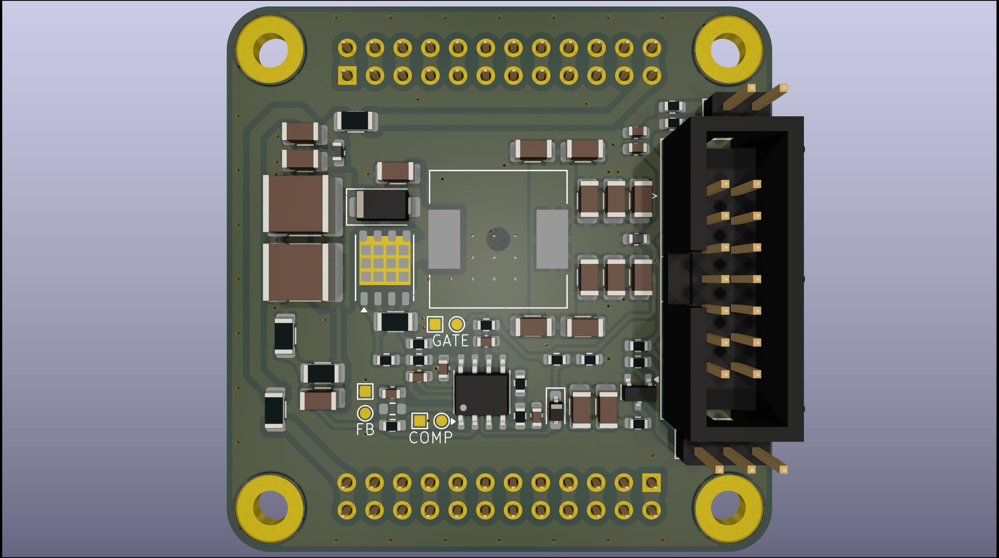
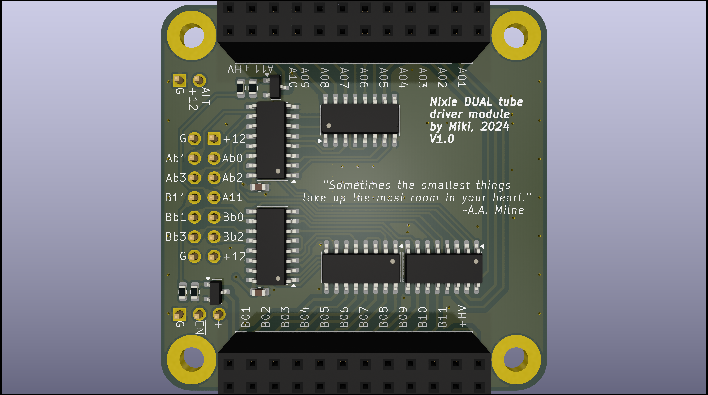
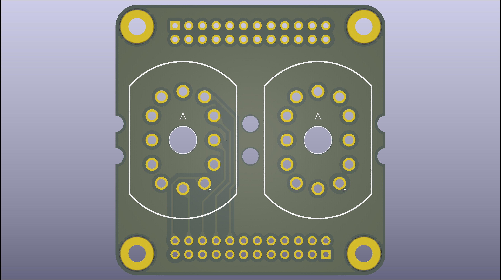
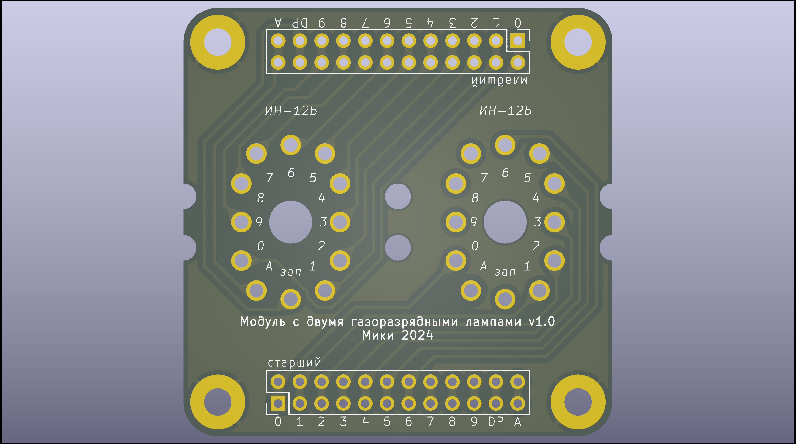

# Modular nixie tube clock system

A versatile and customizable driver for Nixie tube clocks. This project focuses on developing hardware and firmware to drive Nixie tubes, allowing you to create various retro-style displays with ease.

---

## Features

- **Modular design**: Interchangeable pieces with efficient management of high voltages required by nixie tubes.
- **Customizable Firmware**: Adjust timing  of various displayed things at will.
- **Support for Various Tubes**: Compatible with IN-12A, IN-12B and more.
- **Easy Assembly**: Simple PCB design with detailed instructions.
- **Real-Time Clock Integration**: In the future, RTC modules may be integrated into the project.

---

## Hardware

### Components:
1. Nixie Tubes (e.g. IN-12A or IN-12B)
2. Regulated Power Supply (12V DC output)
3. Microcontroller (e.g. STM32 family)
4. Maybe RTC Module? (e.g. DS3231)
5. Darlington Arrays (e.g. SN75468)
6. Demultiplexers (e.g. CD4028B)
7. Boost controller (UCC38XX family)
8. Resistors, Capacitors, Connectors etc.
9. PCB (Custom-designed for this project)

## Driver: 
The circuit consists of a boost converter which steps up the supply voltage to 170VDC. Such voltage is sufficient for ionization of the low-pressure gas mixture inside the tube at room temperature (without the need of white-hot cathode). 

After long battle against procrastination, layout for the driver board emerged. Detailed description and schematic will follow in subsequent sections.

The other half of the circuit is basically massive demultiplexing and buffering array. The good news is that not every cathode needs to be operated idependently but rather only one (two maybe) digit per tube lights up at one time. This points to binary to decimal converters (4028 IC used) and a simple buffering for commas as they may have to be used independently. 

Note author's love for hardcore poetry insertion.

## Dual tube adapter
Someone must hold the tubes in place so here it is:

Holes in pcb in the middle of the tubes' footprints is an answer to the glass short feature at the base, a remainder after sealing process. 
Other holes increase versatility in case someone wished to insert leds in them to achieve obligatory flashing in the space between glowing numerals. 

Note the attempt to match writing on the pcb to native Muttersprache of the late glassblowers responsible for birthing of IN-12s

---

## Software Setup

### Prerequisites
- TBA

## Usage
Assemble the hardware as per the provided schematics.
Power the circuit using the recommended voltage specifications.

At vero eos et accusamus et iusto odio dignissimos ducimus qui blanditiis praesentium voluptatum deleniti atque corrupti quos dolores et quas molestias excepturi sint occaecati cupiditate non provident, similique sunt in culpa qui officia deserunt mollitia animi, id est laborum et dolorum fuga. Et harum quidem rerum facilis est et expedita distinctio. Nam libero tempore, cum soluta nobis est eligendi optio cumque nihil impedit quo minus id quod maxime placeat facere possimus, omnis voluptas assumenda est, omnis dolor repellendus. Temporibus autem quibusdam et aut officiis debitis aut rerum necessitatibus saepe eveniet ut et voluptates repudiandae sint et molestiae non recusandae. Itaque earum rerum hic tenetur a sapiente delectus, ut aut reiciendis voluptatibus maiores alias consequatur aut perferendis doloribus asperiores repellat. 
