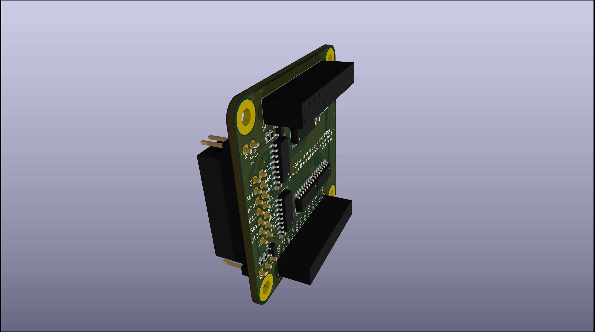
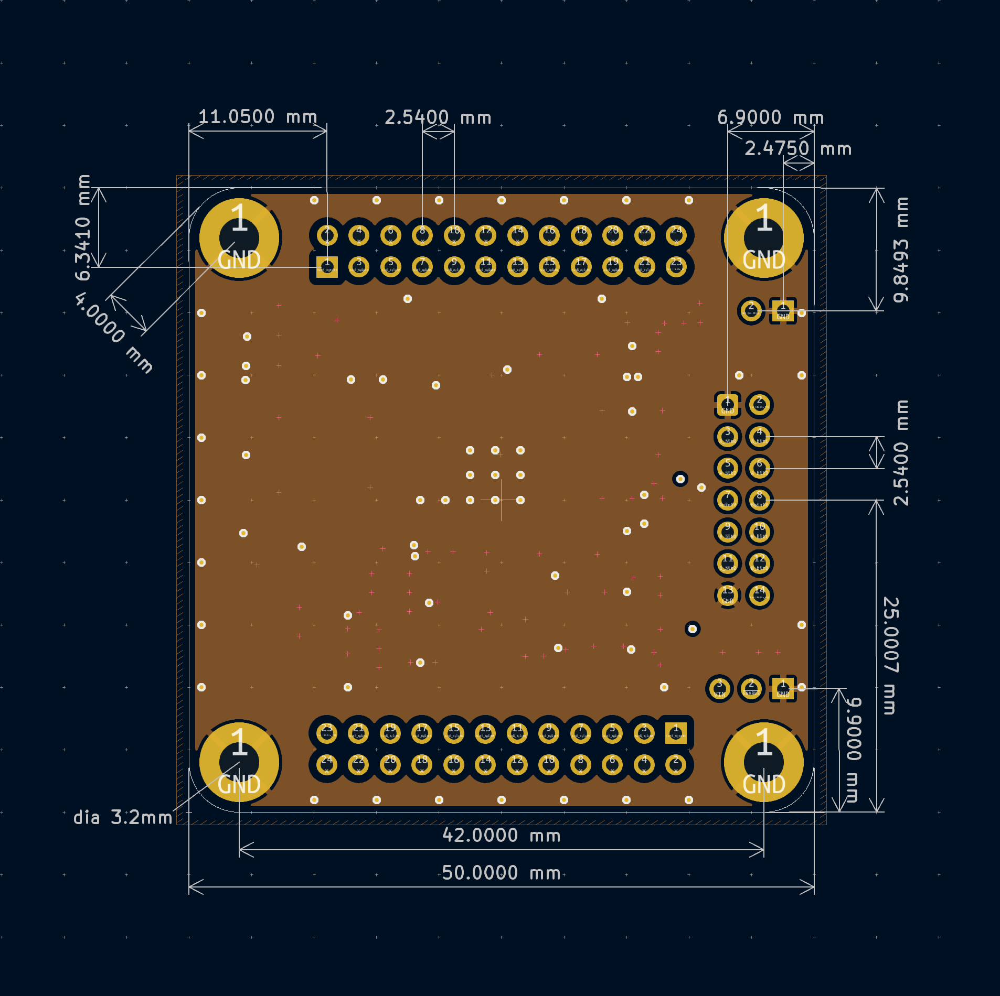
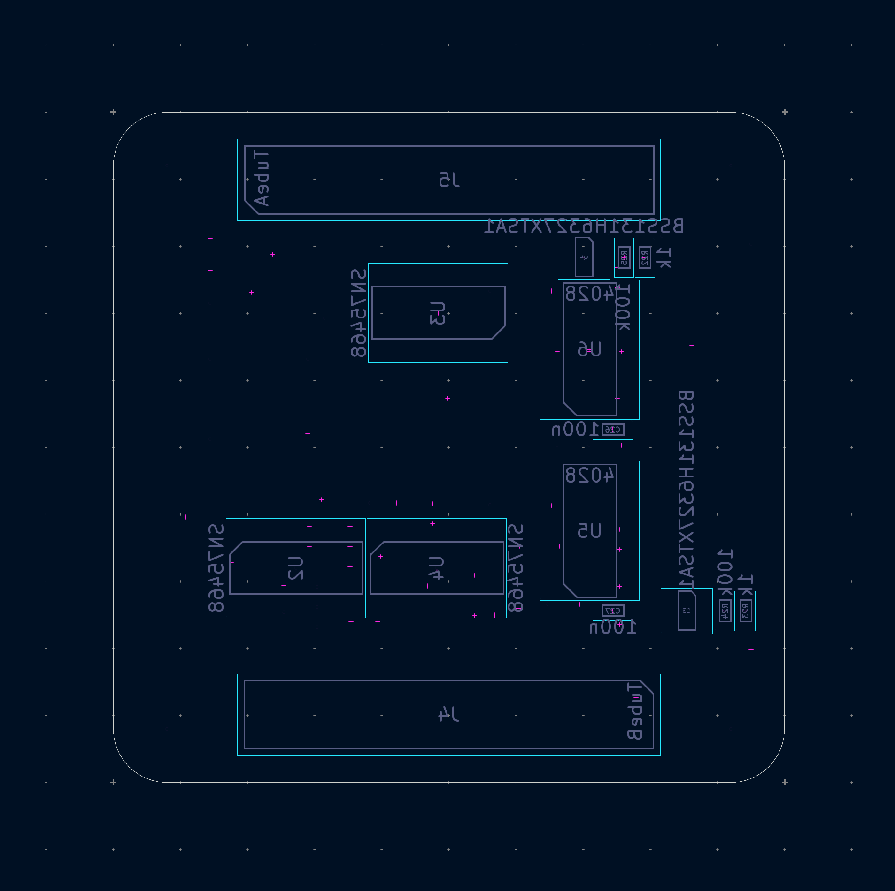
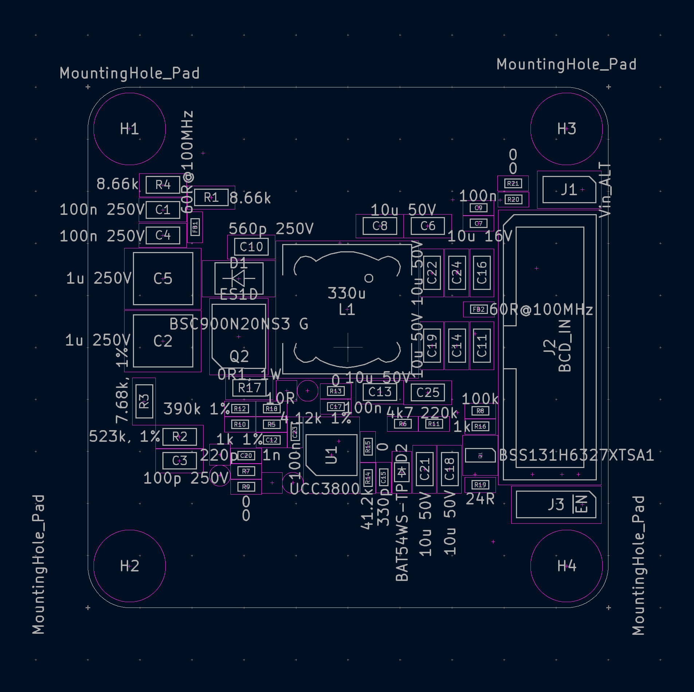

# Modular nixie tube clock system


A versatile and customizable driver for Nixie tube clocks. This project focuses on developing hardware and firmware to drive Nixie tubes, allowing you to create various retro-style displays with ease.

---

## Features

- **Modular design**: Interchangeable pieces with efficient management of high voltages required by nixie tubes.
- **Customizable Firmware**: Adjust timing  of various displayed things at will.
- **Support for Various Tubes**: Compatible with IN-12A, IN-12B and more.
- **Easy Assembly**: Simple PCB design with detailed instructions.
- **Real-Time Clock Integration**: In the future, RTC modules may be integrated into the project.

---

## Hardware

### Components

1. Nixie Tubes (e.g. IN-12A or IN-12B)
2. Regulated Power Supply (12V DC output)
3. Microcontroller (e.g. STM32 family)
4. Maybe RTC Module? (e.g. DS3231)
5. Darlington Arrays (e.g. SN75468)
6. Demultiplexers (e.g. CD4028B)
7. Boost controller (UCC38XX family)
8. Resistors, Capacitors, Connectors etc.
9. PCB (Custom-designed for this project)

## Driver + PSU

The circuit consists of a boost converter which steps up the supply voltage to 170VDC. Such voltage is sufficient for ionization of the low-pressure gas mixture inside the tube at room temperature (without the need of white-hot cathode).

After long battle against procrastination, layout for the driver board emerged. Detailed description and schematic will follow in subsequent sections.

<p align="center">
  
  
</p>

Insulation Displacement Cable connector was chosen as the main medium of communication w/ the micro. This was a direct result of author's recent traumatic experiances and many hours of fruitless work trying to wire previous device using old solid-copper wires which were nearly unsolderable and brittle beyond comprehension. So ribbon cable it is.
Alternative and secondary I/Os were banished to ordinary pin headers for simplicity.

The other half of the circuit is basically massive demultiplexing and buffering array. The good news is that not every cathode needs to be operated idependently but rather only one (two maybe) digit per tube lights up at one time. This points to BCD (binary-coded decimal) converters (4028 IC used) and a simple buffering for commas as they may have to be used independently.

Note author's love for hardcore poetry insertion.

## Dual tube adapter

Someone must hold the tubes in place so here it is: ([see schematic](/files/NixieDriverTwoTubesSockets/NixieDriverTwoTubesSockets_Schematic.pdf))

<p align="center">
  
  
</p>
Holes in pcb in the middle of the tubes' footprints are an answer to the glass short feature at the base, a remainder after sealing process.
Other holes increase versatility in case someone wished to insert leds in them to achieve obligatory flashing in the space between glowing numerals.
Note the attempt to match writing on the pcb to native Muttersprache of the late glassblowers responsible for birthing of IN-12s.

### Dual tube adapter w/ sockets

Socket adaptation requires different footprint and much denser layout.

<p align="center">
  
  
  
</p>
6 layers, yes:
<p align="center">
  
  
  
  
  
  
</p>


---
<!-- 
## Software Setup

### Prerequisites
- TBA

## Usage
Assemble the hardware as per the provided schematics.
Power the circuit using the recommended voltage specifications.

At vero eos et accusamus et iusto odio dignissimos ducimus qui blanditiis praesentium voluptatum deleniti atque corrupti quos dolores et quas molestias excepturi sint occaecati cupiditate non provident, similique sunt in culpa qui officia deserunt mollitia animi, id est laborum et dolorum fuga. Et harum quidem rerum facilis est et expedita distinctio. Nam libero tempore, cum soluta nobis est eligendi optio cumque nihil impedit quo minus id quod maxime placeat facere possimus, omnis voluptas assumenda est, omnis dolor repellendus. Temporibus autem quibusdam et aut officiis debitis aut rerum necessitatibus saepe eveniet ut et voluptates repudiandae sint et molestiae non recusandae. Itaque earum rerum hic tenetur a sapiente delectus, ut aut reiciendis voluptatibus maiores alias consequatur aut perferendis doloribus asperiores repellat. 

---
-->

## Design process

Initially, the goal was to power and control 6-8 tubes (up to 88 cathodes) which very quickly became a routing nightmare. Also the lebensraum cost accumulated very quickly so small pcbs became a necessity. 
But first things first.

## Assumptions

For dual tube version

1. DC-DC step-up converter from 12V in to ~170V out;
2. Switching frequency: ~110kHz
3. Output regulation method: PWM 
4. Power delivered to the load: 2.04mW (4 symbols, up to 3mA per cathode at 170V);
5. Small size: 50mm x 50mm boards (cheap, easy to throw away)
6. 22 cathodes, 2 out of which will stay on and 2 decimal points w/ independent control

## First try

Ok. so let's try single phase boost topology in Constant Current Mode.


In that case helpful can be ic dedicated to boost converter control such as [UCC38xx](https://www.ti.com/lit/ds/symlink/ucc3800.pdf) family


### Duty cycle

Assuming 80% efficiency, DC needed is given by 

```math
U_{OUT} = \frac{U_{IN} \cdot \eta}{1-D}  \implies  D = 1 - \frac{12V \cdot 0.8}{170V} \approx 0.944
```

so half of the [UCC38xx](https://www.ti.com/lit/ds/symlink/ucc3800.pdf) family is already out.

Let's see:
<!--  -->

After DC calculation, only '00, '02 and '03 are left. As input voltage is 12V, let's look at histeretic UnderVoltage LockOut thresholds. '02 version will never even turn on and '03's UVLO range is far too low to be usable.

That leaves [UCC3800](https://www.ti.com/lit/ds/symlink/ucc3800.pdf) as the last chip standing.

### Oscillator

As described in [UCC3800](https://www.ti.com/lit/ds/symlink/ucc3800.pdf)'s datasheet, the frequency of operation is set by RC constant, so to achieve 110kHz we need

```math
f = \frac{1.5}{RC} = \frac{1.5}{41.2k \Omega \cdot 330pF} \approx 110.33kHz
```

### Inductor

Assuming 80% efficiency, mean input current

```math
P_{IN} \cdot 0.8 = 12 mA \cdot 170V \implies I_{IN} = \frac{12 mA \cdot 170V}{0.8 \cdot 12V} = 212.5 mA
```

```math
I_{OUT} = \frac{1}{T} \int_{0}^{T} i \, dt = \frac{12 mA \cdot 170V}{0.8 \cdot 12V} = 212.5 mA
```


```math
\Delta i_{L} \approx (0.2 \; to \; 0.4) \cdot I_{OUT,MAX} \cdot \frac{U_{OUT}}{U_{IN}} = [ , ]
```

```math
L = \frac{U_{IN} \cdot (U_{OUT} - U_{IN}) }{ 2 \cdot f \cdot I_{OUT}} \approx 223 \mu H \implies 330 \mu H
```

For continuous inductor current, half of peak-to-peak value of the ripple shouldn't be bigger than that mean. The minimum inductance is given by:

```math
L \gt \frac{D \cdot U_{IN} \cdot (1-D) }{ 2 \cdot f \cdot I_{OUT}} \approx 223 \mu H \implies 330 \mu H
```


As voltage across the inductor $` U_{L} = L \cdot \frac{\Delta i_{L}}{t_{ON}} `$ and duty cycle $` D = \frac{t_{ON}}{T} = t_{ON} \cdot f `$, ripple current through the inductor is:

```math
\Delta i_{L} = \frac{U_{L} D}{f \cdot L} = \frac{12V \cdot 0.944}{110.33kHz \cdot 330 \mu H} \approx 307.3 mA
```

### Diode

[ES1D](https://www.onsemi.com/pdf/datasheet/es1d-d.pdf) (SMA) was chosen as a cheap yet fast and powerful diode for its

- **200 V** Maximum Repetitive Reverse Voltage and
- **1 A** Average Rectified Forward Current with
- **30 A** pulse capability.

Note the **0.92 V** Forward Voltage @ 1 A

`This is the moment to point out the annoyingly circular character of such design methods. 
To choose the diode, it is necessary to know the max current it will have to handle but the value of its forward voltage drop is needed much earlier in duty cycle calculation. Expect further complaining about this in the upcoming sections.`

### Switch

[BSC900N20NS3 G](https://www.infineon.com/dgdl/Infineon-BSC900N20NS3-DS-v02_02-en.pdf?fileId=db3a30432ad629a6012b144f6b0619db) (PG-TDSON-8) was deemed worthy:

- **200 V** $`V_{DS}`$
- **90 mΩ** max $`R_{DS(on)}`$
- **15.2 A** $`I_{D}`$


### Current limiting
A 1-V (typical) cycle-by-cycle current limit threshold is incorporated into the UCC280x family. Resistors R14
and R15 bias the actual current sense resistor voltage up, allowing a small current sense amplitude to be used. 

max 323.9mA over 0.1R is 32.39mV so 967.61mV offset is needed


```math
V_{OFFSET} = \frac{R15}{R14 + R15} \cdot V_{REF}
```


### Output capacitor

```math
\Delta U_{OUT} = \frac{D \cdot I_{OUT}}{C_{OUT}} \implies C_{OUT} = \frac{0.9298 \cdot 12 mA}{0.1 V} \approx 1.01 \mu F
```

## Simulation


TODO:  y LaTeX does not work in md?!








