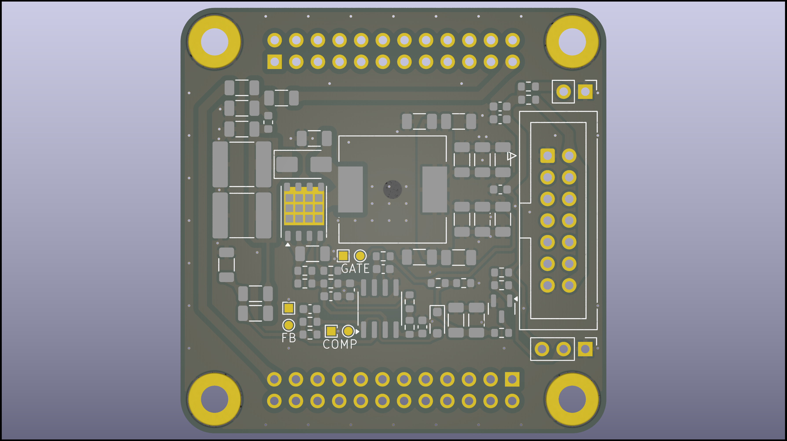

# Modular nixie tube clock system


A versatile and customizable driver for Nixie tube clocks. This project focuses on developing hardware and firmware to drive Nixie tubes, allowing you to create various retro-style displays with ease.

---

## Features

- **Modular design**: Interchangeable pieces with efficient management of high voltages required by nixie tubes.
- **Customizable Firmware**: Adjust timing  of various displayed things at will.
- **Support for Various Tubes**: Compatible with [IN-12A](https://www.tube-tester.com/sites/nixie/dat_arch/IN-12A_IN-12B_03.pdf), [IN-12B](https://www.tube-tester.com/sites/nixie/dat_arch/IN-12A_IN-12B_03.pdf) and more.
- **Easy Assembly**: Simple PCB design with detailed instructions.
- **Real-Time Clock Integration**: In the future, RTC modules may be integrated into the project.

---

## Hardware

### Components

1. Nixie Tubes (e.g. [IN-12A](https://www.tube-tester.com/sites/nixie/dat_arch/IN-12A_IN-12B_03.pdf) or [IN-12B](https://www.tube-tester.com/sites/nixie/dat_arch/IN-12A_IN-12B_03.pdf))
2. Regulated Power Supply (12V DC output)
3. Microcontroller (e.g. STM32 family)
4. Maybe RTC Module? (e.g. DS3231)
5. Darlington Arrays (e.g. SN75468)
6. Demultiplexers (e.g. CD4028B)
7. Boost controller ([UCC380x](https://www.ti.com/lit/ds/symlink/ucc3800.pdf) family)
8. Resistors, Capacitors, Connectors etc.
9. PCB (Custom-designed for this project)

## Driver + PSU

The circuit consists of a boost converter which steps up the supply voltage to 170VDC. Such voltage is sufficient for ionization of the low-pressure gas mixture inside the tube at room temperature (without the need of white-hot cathode).

After long battle against procrastination, layout for the driver board emerged (see [driver schematic](/files/NixieDriverEvenSmallerNoDot/NixieDriverEvenSmallerNoDot.pdf)). Detailed description will follow in subsequent sections.

<p align="center">
  
  
</p>

<p align="center">
  
  
  
  
  
  
</p>

Insulation Displacement Cable connector was chosen as the main medium of communication w/ the micro. This was a direct result of author's recent traumatic experiances and many hours of fruitless work trying to wire previous device using old solid-copper wires which were nearly unsolderable and brittle beyond comprehension. So ribbon cable it is.
Alternative and secondary I/Os were banished to ordinary pin headers for simplicity.

The other half of the circuit is basically massive demultiplexing and buffering array. The good news is that not every cathode needs to be operated idependently but rather only one (two maybe) digit per tube lights up at one time. This points to BCD (binary-coded decimal) converters (4028 IC used) and a simple buffering for commas as they may have to be used independently.

Note author's love for hardcore poetry insertion.

## Dual tube adapter

Someone must hold the tubes in place so here it is: (see [adapter schematic](/files/NixieDriverTwoTubesSockets/NixieDriverTwoTubesSockets_Schematic.pdf))

<p align="center">
  
  
</p>
Holes in pcb in the middle of the tubes' footprints are an answer to the glass short feature at the base, a remainder after sealing process.
Other holes increase versatility in case someone wished to insert leds in them to achieve obligatory flashing in the space between glowing numerals.
Note the attempt to match writing on the pcb to native Muttersprache of the late glassblowers responsible for birthing of IN-12s.

### Dual tube adapter w/ sockets

Socket adaptation requires different footprint and much denser layout.

<p align="center">
  
  
  
</p>
6 layers, yes:
<p align="center">
  
  
  
  
  
  
</p>


---
<!-- 
## Software Setup

### Prerequisites
- TBA

## Usage
Assemble the hardware as per the provided schematics.
Power the circuit using the recommended voltage specifications.

At vero eos et accusamus et iusto odio dignissimos ducimus qui blanditiis praesentium voluptatum deleniti atque corrupti quos dolores et quas molestias excepturi sint occaecati cupiditate non provident, similique sunt in culpa qui officia deserunt mollitia animi, id est laborum et dolorum fuga. Et harum quidem rerum facilis est et expedita distinctio. Nam libero tempore, cum soluta nobis est eligendi optio cumque nihil impedit quo minus id quod maxime placeat facere possimus, omnis voluptas assumenda est, omnis dolor repellendus. Temporibus autem quibusdam et aut officiis debitis aut rerum necessitatibus saepe eveniet ut et voluptates repudiandae sint et molestiae non recusandae. Itaque earum rerum hic tenetur a sapiente delectus, ut aut reiciendis voluptatibus maiores alias consequatur aut perferendis doloribus asperiores repellat. 

---
-->

## Design process

Initially, the goal was to power and control 6-8 tubes (up to 88 cathodes) which very quickly became a routing nightmare. Also the lebensraum cost accumulated very quickly so small pcbs became a necessity. 
But first things first.

## Assumptions

For dual tube version

1. step-up converter from regulated **12VDC** in to **170VDC** out;
2. Switching frequency: sth like **110kHz**
3. Output regulation method: **PWM**
4. Power delivered to the load: **2.04mW** (4 symbols, up to 3mA per cathode at 170V);
5. Small size: 50mm x 50mm boards (cheap, easy to throw away)
6. 22 cathodes, 2 out of which will stay on and **2 commas w/ independent control**

## First try

Ok. so let's try single phase boost topology in Constant Current Mode. 

In that case helpful can be ic dedicated to boost converter control such as [UCC380x](https://www.ti.com/lit/ds/symlink/ucc3800.pdf) family from TI:

<p align="center">
  
</p>

<p align="center">
  
</p>


<p align="center">
  
</p>

---

### Duty cycle and PWM Controller

Assuming 80% efficiency, DC needed is given by 

```math
U_{out} = \frac{U_{in} \cdot \eta}{1-D}  \implies  D = 1 - \frac{12V \cdot 0.8}{170V} \approx \mathbf{0.944}
```

so half of the [UCC380x](https://www.ti.com/lit/ds/symlink/ucc3800.pdf) family is already out.

Let's see:
<!--  -->

After DC calculation, only '0, '2 and '3 are left. As input voltage is 12V, let's look at histeretic UnderVoltage LockOut thresholds. '2 version will never even turn on and '3's UVLO range is far too low to provide any protection.

> That leaves [UCC3800](https://www.ti.com/lit/ds/symlink/ucc3800.pdf) as the last chip standing.

---

### Oscillator

As described in [UCC3800](https://www.ti.com/lit/ds/symlink/ucc3800.pdf)'s datasheet, the frequency of operation is set by RC constant, so to achieve 110kHz we need

```math
f = \frac{1.5}{RC} = \frac{1.5}{\mathbf{41.2k \Omega} \cdot \mathbf{330pF}} \approx 110.33kHz
```

> C15 = **330 pF** C0G
> R14 = **41.2 kΩ** ±1%
> R15 = 0 Ω

---

### Inductor

Mean output current:

```math
I_{out} = \frac{1}{T} \int_{0}^{T} i_{out} \, dt = \frac{1}{T} (\frac{1}{2} \Delta i_{out} (1-D)T + i_{min}T) = \frac{1}{2} \Delta i_{out} (1-D) + i_{min}
```

As voltage across the inductor $` U_{L} = L \cdot \frac{\Delta i_{L}}{t_{on}} `$ and duty cycle $` D = \frac{t_{on}}{T} = t_{on} \cdot f `$, ripple current through the inductor is:

```math
\Delta i_{L} = \frac{U_{L} D}{f \cdot L}
```

so the mean output current:

```math
I_{out} = \frac{U_{in} D (1-D)}{2 f L}  + i_{min}
```

For continuous inductor current, **minimum current must be positive** ( $`i_{min} > 0`$ ). The lower bound on inductance is then given by:

```math
L \gt \frac{D \cdot U_{in} \cdot (1-D) }{ 2 \cdot f \cdot I_{out}} \approx 239.6 \mu H \implies \mathbf{L = 330 \mu H}
```

Inductor's ripple current:

```math
\Delta i_{L} = \frac{U_{L} D}{f \cdot L} = \frac{12V \cdot 0.944}{110.33kHz \cdot 330 \mu H} \approx 311.1 mA
```

Maximum current through the inductor:

```math
\mathbf{i_{L, max}} = i_{min} + \Delta i_{L} = I_{out} - \frac{1}{2} \Delta i_{L}(1 - D) + \Delta i_{L} \approx \mathbf{314.39 mA}
```
is also the maximum current through the switch.

> [DE1207-330](https://www.tme.eu/Document/d1f8b47d020ebf11f3b92c6891638dfa/de.pdf) shielded inductor from FERROCORE's "SMD Power Coil" family was chosen
- **330 μH**
- **471 mΩ** DC resistance
- 1207 package (12mm x 12mm x 8mm)

---

### Diode

> [ES1D](https://www.onsemi.com/pdf/datasheet/es1d-d.pdf) (SMA) was chosen as a cheap yet fast and powerful diode for its

- **200 V** Maximum Repetitive Reverse Voltage and
- **1 A** Average Rectified Forward Current with
- **30 A** pulse capability.

Note the **0.92 V** Forward Voltage @ 1 A

`This is the moment to point out the annoyingly circular character of such design methods. 
To choose the diode, it is necessary to know the max current it will have to handle but the value of its forward voltage drop is needed much earlier in duty cycle calculation. Expect further complaining about this in the upcoming sections.`

---

### Switch

> [BSC900N20NS3 G](https://www.infineon.com/dgdl/Infineon-BSC900N20NS3-DS-v02_02-en.pdf?fileId=db3a30432ad629a6012b144f6b0619db) (PG-TDSON-8) was deemed worthy:

- **200 V** $`V_{DS}`$
- **90 mΩ** max $`R_{DS(on)}`$
- **15.2 A** $`I_{D}`$
- 2.2 Ω typ $`R_{G}`$
- **11.6 nC** max $`Q_{g}`$

---

### Output capacitor

To filter the output signal, let's use capacitance of:

```math
\Delta U_{out} = \frac{I_{out}}{C_{out} \cdot f} \implies \mathbf{C_{out}} \gt \frac{12 mA}{0.1 V \cdot 110.33 kHz} \approx \mathbf{1.09 \mu F}
```

> [C5750X7R2E105K230KA](https://www.tme.eu/Document/3927045cdc4027c1c18ebf074683adec/c-series.pdf) (2220) from TDK's "C series"
- **2 μF** ± 10%
- **250 V** rated DC voltage
- **X7R** dielectric material

Note the ±15% temperature coefficient (capacitance change) over the whole temp. range ( –55 to +125 °C )

In the design, two 2220 footprints were used to accomodate various capacitor configurations.

---

### Current sensing network

<p align="center">
  
</p>

A 1-V (typical) cycle-by-cycle current limit threshold is incorporated into the [UCC380x](https://www.ti.com/lit/ds/symlink/ucc3800.pdf) family. Resistors R9
and R11 bias the actual current sense resistor voltage up, allowing a small current sense amplitude to be used.

> [ERJ-8BWFR100V](https://industrial.panasonic.com/cdbs/www-data/pdf/RDN0000/AOA0000C313.pdf) (1206) thick film chip resistor from PANASONIC

- **0.1 Ω** ±1%
- 100ppm/°C


max 314.39 mA over 0.1R is 31.439mV so 968.561 mV offset is needed


```math
U_{offset} = \frac{R9}{R11 + R9} \cdot U_{ref} \implies \mathbf{\frac{R11}{R9}} = \frac{5 V}{0.968561 V} - 1 = 4.1623
```

> R5 = **4.12 kΩ** ±1%
> R10 = **1 kΩ** ±1%
> R12 = **390 kΩ** ±1%

TODO:

---

### Voltage feedback loop

<p align="center">
  
</p>

Voltage at FB pin is compared to **reference halved** so a voltage divider of:

```math
\frac{U_{ref}}{2} = \frac{U_{out} \cdot R3}{R3 + R2} \implies \mathbf{\frac{R2}{R3}} = \frac{170 V}{2.5 V} - 1 = 67 = \mathbf{\frac{514.56 k\Omega}{7.68 k\Omega}}
```

is needed. In practice, choosing from ±1% E96 series:

> **R2 = 523 kΩ** ±1%
> **R3 = 7.68 kΩ** ±1%

This tolerance implies output voltage range of [169.3 V; 176.2 V] and about 300-μA leakage current.

---

## Simulation

Quick and idealized circuit, using values calculated above, was simulated in [PLECS](https://www.plexim.com/products/plecs) - simulation platform for power electronic systems. 

After some time, our system reached steady state which is demonstrated below:


As we can see, all noise from FET turning on/off was omitted as well as parasitic capacitances all across the system. This simulation is only a means of reassurance that calculations weren't too far off and so the project can advance into 'spending money' stage.

---

## Miscellaneous

TODO:  y LaTeX does not work in md on mobile?!





